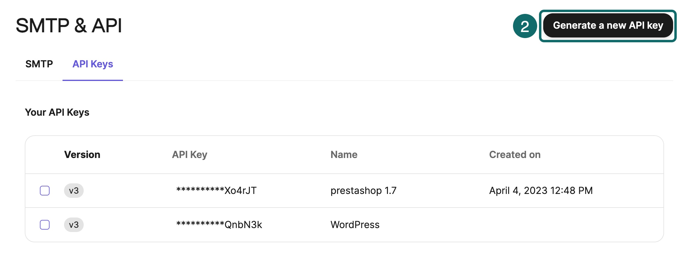
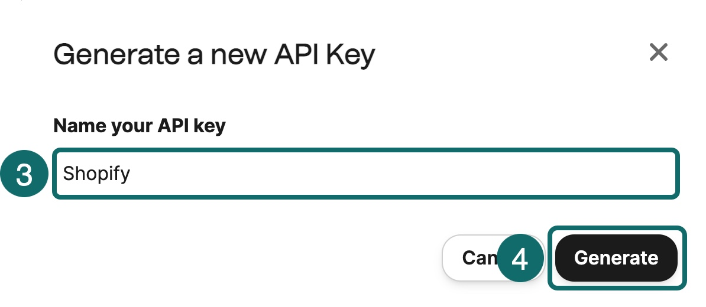

# Arquitetura da Solução - CQRS e Event Sourcing com Azure Functions

Esta solução utiliza **CQRS (Command Query Responsibility Segregation)** e **Event Sourcing** para gerenciar o cadastro de usuários e o envio de e-mails e mensagens de WhatsApp utilizando o **Azure Service Bus** e a plataforma **Brevo**.

## Arquitetura

- **CQRS e Event Sourcing**: Arquitetura para separar comandos e consultas, garantindo um controle robusto sobre os dados e eventos no sistema.

A arquitetura da aplicação é composta por diversas Azure Functions e serviços do Azure, que se comunicam através de tópicos do **Azure Service Bus**. A solução é dividida em várias funções que se ocupam de diferentes responsabilidades, e cada uma é acionada por mensagens publicadas em tópicos específicos.

### Componentes Principais

- **Azure Service Bus**: Utilizado para comunicação entre os diferentes consumidores e produtores de mensagens.
- **Azure Functions**: Funções assíncronas que processam as mensagens publicadas no Service Bus.
- **Brevo**: Plataforma usada para envio de e-mails.
- **Whatsapp**: Plataforma usada para envio de notificações no Whatsapp.
- **MongoDb**: Banco NoSql para armazenar as mensagens que nao puderam ser entregues ou que falharam.

### Funções Azure

1. **Register**: Esta função é responsável por registrar um novo usuário. Ela recebe a solicitação de registro, utiliza o padrão **Mediator** para disparar o comando, e ao ser processado, envia um evento com as informações do usuário.

2. **DeadLetterProcess**: Esta função é responsável por processar mensagens que não puderam ser entregues ou que falharam, registrando as falhas no mongoDb.

3. **WelcomeEmailProcessing**: Esta função consome mensagens da subscrição `welcome.email` no **Azure Service Bus**. Ao receber um evento de "usuário cadastrado", ela utiliza a plataforma **Brevo** para enviar um e-mail de boas-vindas ao usuário.

4. **WelcomeWhatsappProcessing**: Similar à função de e-mail, mas consome mensagens da subscrição `welcome.whatsapp` e envia uma mensagem de boas-vindas via WhatsApp.

## vantagens em utilizar o processo de fila 

## 1. Processamento assincrono de mensagens 

## 2. Resiliência Durante Falhas Temporárias da Aplicação
Caso a sua aplicação fique temporariamente fora do ar, as mensagens na fila não serão perdidas. Elas permanecerão na fila até que o sistema esteja disponível para processá-las, garantindo a continuidade dos processos e a integridade dos dados.

## 3. Retry (Tentativas de Reenvio Automáticas)
As filas de mensagens oferecem suporte automático para tentativas de reenvio, permitindo que, caso uma mensagem falhe ao ser processada, o sistema tente novamente em intervalos definidos. Isso aumenta a confiabilidade do processamento, garantindo que mensagens não sejam perdidas devido a falhas temporárias.

## CQRS e Event Sourcing

### Comandos

- **Comando de Registro de Usuário**: Quando o usuário se registra, um comando é disparado para criar o usuário no sistema. Esse comando é tratado por um **Handler** que, ao finalizar a execução, emite um evento de "usuário cadastrado".

### Eventos

- **Evento de Usuário Cadastrado**: Este evento contém as informações do usuário (nome, telefone, e-mail e ID) e é publicado no **Azure Service Bus** para ser consumido pelas funções responsáveis pelo envio de e-mails e mensagens de WhatsApp.

### Mediator

- O **Mediator** é utilizado para disparar e processar os comandos dentro da aplicação, facilitando o desacoplamento entre as funções e o controle de fluxo dos comandos.

### Event Sourcing

- Utilizamos **Event Sourcing** para garantir que todas as mudanças no estado do sistema sejam representadas por eventos. Em vez de gravar os dados diretamente em uma tabela ou banco de dados, gravamos os eventos que representam as mudanças e reconstituímos o estado do sistema a partir desses eventos.

## Configuração do Ambiente

### Azure Service Bus

- Certifique-se de ter um **Azure Service Bus** configurado com um tópicos:
  - `client.created`

- e certifique-se de ter as duas Subscriptions de boas vindas 
   - `welcome.email`
   - `welcome.whatsapp`

Cada uma dessas **Subscription** será consumida pelas respectivas funções de processamento no **Azure Functions**.

### Plataforma Brevo
- Configure as credenciais de integração com o **Brevo** para enviar e-mails de boas-vindas.

- Crie uma chave API Ao configurar uma integração com sua conta Brevo, você pode precisar criar uma nova chave API:

- Clique em Gerar.

- Clique em OK.

- As credenciais podem ser armazenadas em **Azure Key Vault** ou no **App Settings** da função para maior segurança.

### Dead Letter Queue

- Configure a **Dead Letter Queue** no Azure Service Bus para capturar mensagens falhas.
- A **DeadLetterProcessFunction** pode ser configurada para processar essas mensagens e realizar ações corretivas ou registrar o erro.

## Como Funciona o Fluxo

1. O usuário faz uma solicitação de registro através do endpoint `RegisterFunction`.
2. O comando é disparado e, ao ser processado, um evento é publicado em um tópico do **Azure Service Bus**.
3. O evento de cadastro de usuário é consumido por duas funções (para e-mail e WhatsApp) que enviam as respectivas mensagens.
4. Se houver falha em qualquer parte do processo, as mensagens são enviadas para a **Dead Letter Queue** e processadas pela função `DeadLetterProcessFunction`.

## Conclusão

Essa arquitetura baseada em **CQRS** e **Event Sourcing** garante escalabilidade e flexibilidade na forma como os dados são gerenciados e processados. Utilizando **Azure Service Bus** para a comunicação entre as funções, conseguimos desacoplar os componentes do sistema, permitindo que diferentes processos sejam executados independentemente e em paralelo.

A integração com **Brevo** e o envio de mensagens via **WhatsApp** tornam a aplicação ainda mais poderosa, proporcionando uma experiência completa de boas-vindas para o usuário.

---

### Tecnologias Utilizadas

- **Azure Functions**
- **Azure Service Bus**
- **CQRS**
- **Event Sourcing**
- **Mediator Pattern**
- **Brevo (para envio de e-mails)**
- **Whatsapp (para envio de mensagens)**